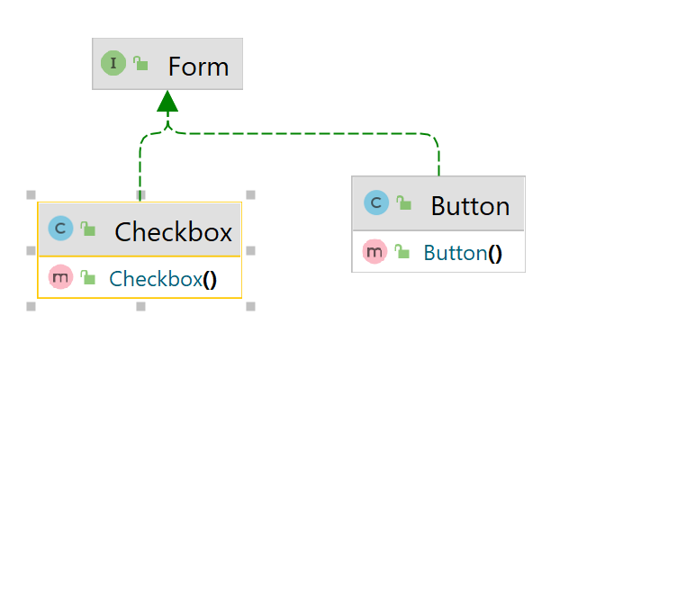
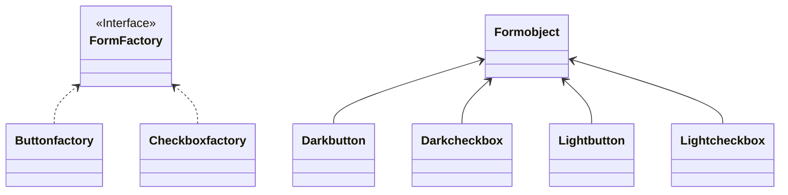

# FACTORY DESIGN PATTERN

It is mostly used in frontend, factory components.

Let's take an example,
Suppose we want to create a button factory,
where we need primary button, round button, secondary button.

```java
public abstract class Button {

}

class PrimaryButton extends Button{

}

class RoundButton extends Button{

}

class SecondaryButton extends Button{

}

class Client{
    Button button = new PrimaryButton();
    Button button1 = new SecondaryButton();
}
```

Here, Client code is directly dependent on Subclasses, 
In the future, Subclasses might be deleted, so then Client code breaks.
But there are fewer chances of deleting abstract class or interface.

So Client code shouldn't depend on Subclasses, but rather depend on Abstract classes or interface.

Here arrives our Factory pattern.

Actually Factory pattern has three types
1. Simple factory
2. Factory method
3. Abstract Factory

Let's look at Simple factory

Simple factory just says create a method, such that 
It creates the objects of child class.
Here are steps.
1. Create Interface for product
2. Create Concrete classes for each product.
3. Create Factory class
4. Create a static method, which is responsible for logic construction of which object need to be created, based on type provided.
5. create a Enum for type

```java
// product Interface
interface Button{
    
}
```

```java
// //product type
class PrimaryButton extends Button{
    
}
```

````java
class SecondaryButton extends Button{
    
}
````

```java
class RoundButton extends Button{
    
}
```
```java
// Types 
enum ButtonType{
    PRIMARY_BUTTON, SECONDARY_BUTTON, ROUND_BUTTON
}
```


```java
class SimpleFactory{
    public static Button getButton(ButtonType buttonType){
        switch (buttonType){
            case ButtonType.PRIMARY_BUTTON:{
                
                return new PrimaryButton();
            }
            case ButtonType.SECONDARY_BUTTON:{
                
                return new SecondaryButton();
            }
            case ButtonType.RoundButton():{
                
                return new RoundButton();
            }
        }
        throw new IllegalArgumentException("Check the Button type");
    }
}
```

Here It solves the child subclasses problem, but here there are problems.

1. It violates Open Close Principle.
    * If we want to change Constructor, we need open this class for modification, like if we want pass argument in constructor.
2. It violates SRP.
    * Here there are many reasons to change, like if change arguments of any constructor primary, secondary, or round.
3. It's Construction logic becomes harder, if we want to add more cases, if mobile view, there could be more cases.

So, Here comes the Factory Method.

<strong> Factory Method</strong> <br>

```html
Steps 
1. Create a product Interface.
2. Create Concrete product classes.
3. Create an interface/abstract factory class.
4. In abstract class/ interface create factorymethods.
5. Create concrete factory classes that implements the factory interface.

```




step 1: create a product interface.
```java
interface Button {
    
}
```

Step 2: create concrete product classes
```java
class Primarybutton implements Button {
    
}
```

```java
class Roundbutton implements Button {
    
}
```

Step 3: Create an factory interface
Step 4: Declare a method for creating instance of product
```java
interface Buttonfactory{
    Button createButton();
}
```

Step 5: create Concrete factory classes.
```java
class PrimaryButtonFactory implements Buttonfactory {

   @Override
   Button createButton(){
       return new Primarybutton();
   }
}
```

```java
class RoundButtonFactory implements Buttonfactory{
    @Override
    Button createButton(){
        return new Roundbutton();
    }
}
```

Here Client code looks like 

```java
public class Client{
   public static void main(String[] args) {
      Buttonfactory buttonfactory = new PrimaryButtonFactory();
      Button instance = buttonfactory.createButton();
   }
}
```

Here we are exposing Subclass factory, we can avoid that by creating GetInstance class.

3. Abstract Factory :

In the above method, what if we also have checkbox,
If it is form we have to change the Buttonfactory to formfactory and add create checkbox to it.
if it simple we need checkbox independently, we create new interface for checkbox, and create new classes which implement it.
it goes like this,

```java
interface Checkbox{
    
}
```

```java
class SquareCheckbox implements Checkbox{
    
}
```


```java
interface CheckboxFactory {
   Checkbox createCheckbox();
}
```

```java
class SquareCheckbox{
    Checkbox createCheckbox(){
        return new SquareCheckbox();
    }
}
```

we can also extend multiple type of check boxes.

If for suppose, it is a form, which contains button and checkbox then,

```java
abstract class Form{
    
}
```

```java
class Button extends Form{
    
}
```

```java
class Checkbox extends Form{
    
}
```

```java
interface Formfactory {
    public void create();
}
```

```java
class ButtonFactory implements Formfactory {
   @Override
   Button create() {
      return new Button();
   }
}
```

```java
class CheckboxFactory implements Formfactory{
    @Override
   public Checkbox create(){
        return new Checkbox();
    }
}
```

### <u> Requirements </u>
but if there is something like theme, which is attribute in form. which is dark or light,

1. if we select dark theme on form then we need to get dark button and dark checkbox.

2. if we select light theme on form, then we need to get dark button and dark checkbox.

So here there is a family kind of thing, lets look into it.



If we create, how can we restrict dark Button and dark Checkbox, so this is not good design. instead we go for.

```mermaid

```