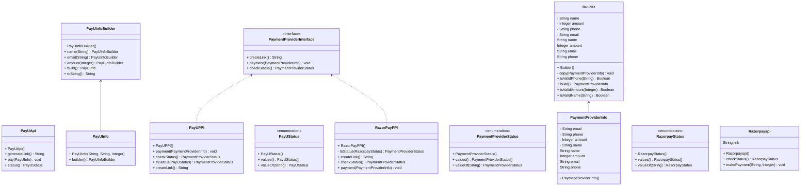

### ADAPTOR DESIGN PATTERN

As the name suggests, it comes into play, when two interfaces are incompatible, but they are dependent.

For example,

If we are fetching data from somewhere, it is xml type, but some users want it in json format, some in xml , some in yaml, some in csv, some in html.
But is it good that we give each a different end point, and duplicate code, simple anwer is no.
So instead we give query at end after endpoint.

And we handle it after fetching data from endpoint.

If we are designing the ecommerce site, where we are handling payment part,
Then we need to accept all banks, so it is actually taken care by companies like RazorPay, PayU, Stripe.

But their method definations are different, so we need to make compatible.

So for that we introduce interface which behaves like adapter between their api and out api. and makes it compatible.

